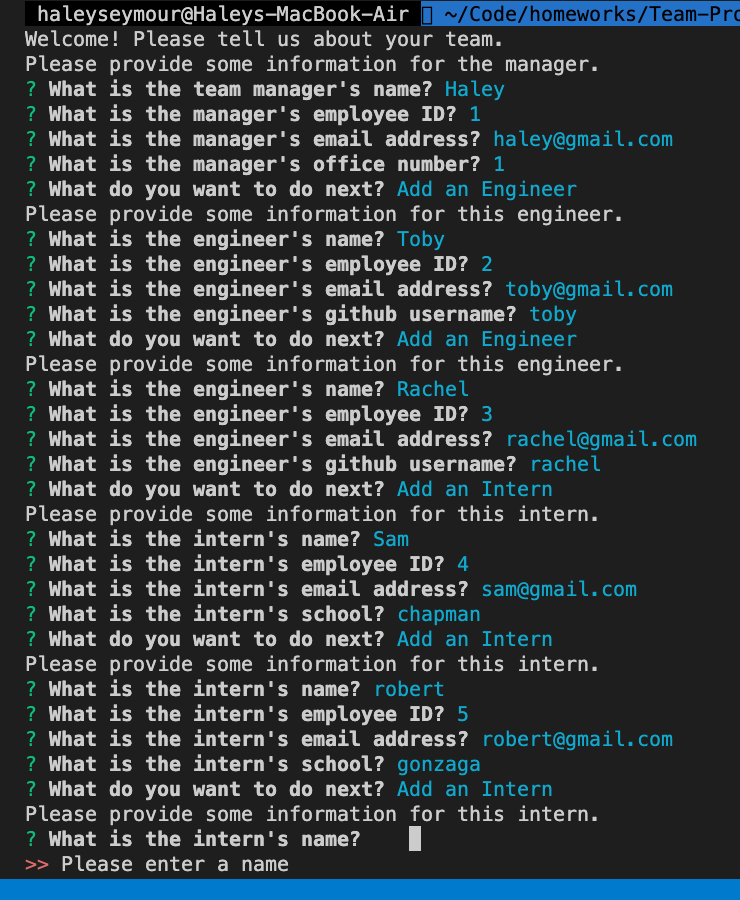
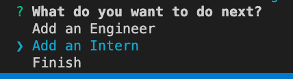
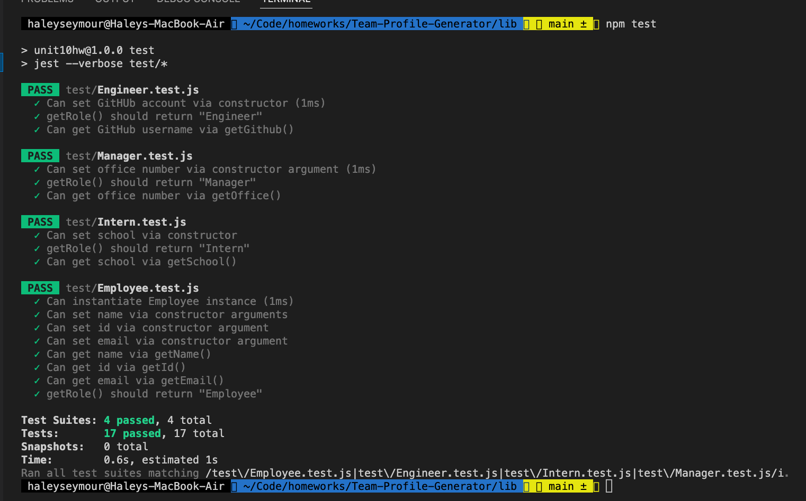

# **Team-Profile-Generator**

## **Table of Contents**
---
- [**Team-Profile-Generator**](#team-profile-generator)
  - [## **Table of Contents**](#-table-of-contents)
  - [## **License**](#-license)
  - [## **Installation**](#-installation)
  - [## **Packages**](#-packages)
  - [## **Description**](#-description)
  - [## **Usage**](#-usage)
  - [### **Screenshots**](#-screenshots)
  - [## **Contributing**](#-contributing)
  - [## **Tests**](#-tests)
  - [## **Questions?**](#-questions)

 

## **License** 
---
[MIT License](../LICENSE)  

MIT License

Copyright (c) 2022 Haley Seymour

Permission is hereby granted, free of charge, to any person obtaining a copy
of this software and associated documentation files (the "Software"), to deal
in the Software without restriction, including without limitation the rights
to use, copy, modify, merge, publish, distribute, sublicense, and/or sell
copies of the Software, and to permit persons to whom the Software is
furnished to do so, subject to the following conditions:

The above copyright notice and this permission notice shall be included in all
copies or substantial portions of the Software.

THE SOFTWARE IS PROVIDED "AS IS", WITHOUT WARRANTY OF ANY KIND, EXPRESS OR
IMPLIED, INCLUDING BUT NOT LIMITED TO THE WARRANTIES OF MERCHANTABILITY,
FITNESS FOR A PARTICULAR PURPOSE AND NONINFRINGEMENT. IN NO EVENT SHALL THE
AUTHORS OR COPYRIGHT HOLDERS BE LIABLE FOR ANY CLAIM, DAMAGES OR OTHER
LIABILITY, WHETHER IN AN ACTION OF CONTRACT, TORT OR OTHERWISE, ARISING FROM,
OUT OF OR IN CONNECTION WITH THE SOFTWARE OR THE USE OR OTHER DEALINGS IN THE
SOFTWARE.
  

 

## **Installation** 
---
To install this project, start by forking this repository on GitHub. Clone this project to your machine by using the "git clone" + URL comamnd. Open the project with your favorite text editor, like VS Code. This project includes a package.json file that specifies dependencies for the project, so be sure to run "npm install". 

 

## **Packages** 
---
Inquirer, Jest

 

## **Description**
---
The motivation for this project is to create a webpage to easily organize employee information for your work team. It aims to assist managers in keeping track of the engineers and interns under them, as well as contact information like email, content porfolios like Github, and school association for interns. The generated page is easy to read and contains links to the necessary information.    
This project is not deployed.   

## **Usage** 
---
To use this project, open the "index.js" file in your integrated terminal. Run the command "node index.js" and a series of prompts will begin. First you will be prompted for the manager's information, and then you can elect to add Engingeers and Interns (no max). Once you are finished, select "Finish" from the menu, and an index.html file will be generated. Open this page in your browser to view the final product. 

### **Screenshots**
--- 
Completed Prompts with Validation Message  

 
Prompt Menu  

 
Testing Suite Passing Results  

 

 

## **Contributing** 
---
This project was completed by myself, Haley Seymour, with starter code provied from the University of Washington Web Development Bootcamp. If you would like to contribute, please do and let me know if you have any questions.

 

## **Tests** 
---
Testing utilizes 'Jest' and tests are included in a folder titled "test". Open the library files in your integrated terminal and run the command "npm test" (after installing) to run 17 tests on 4 test suites. 

 

## **Questions?** 
---
Please contact me on Github at [hseymo](https://github.com/hseymo) or by [email](mailto:haleycseymour@comcast.net).